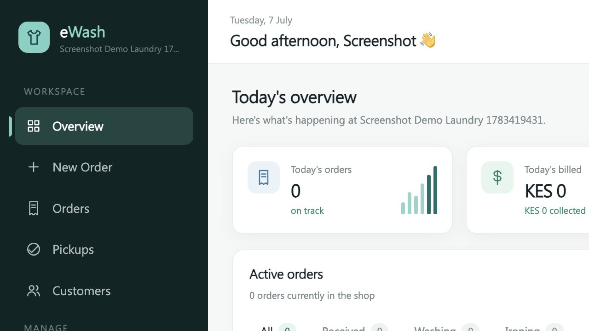
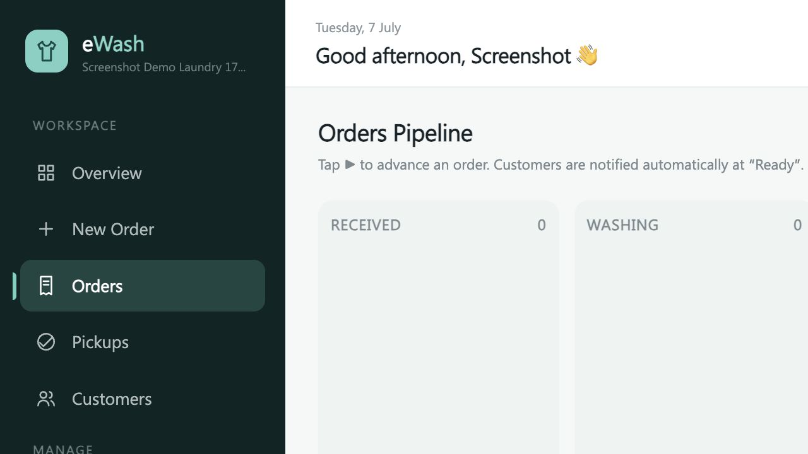
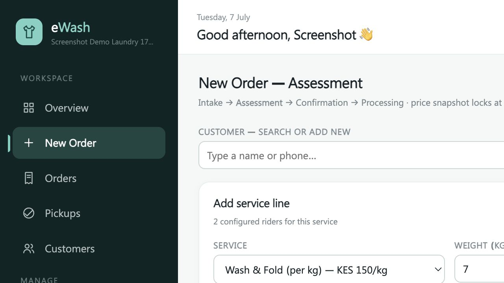
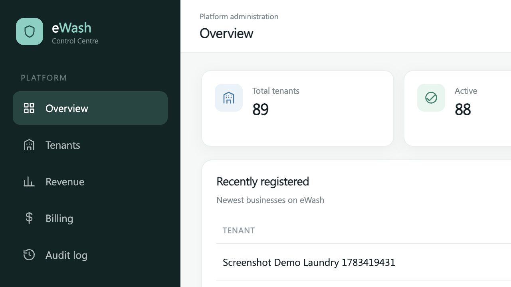
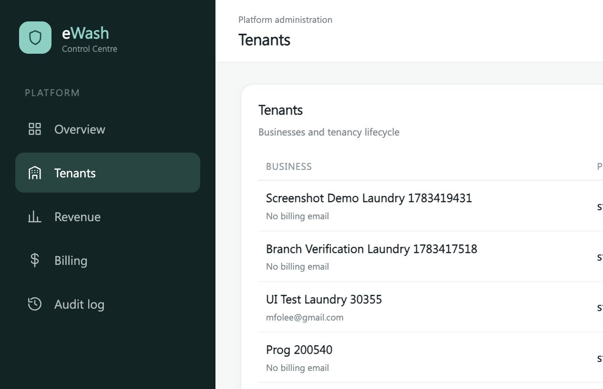
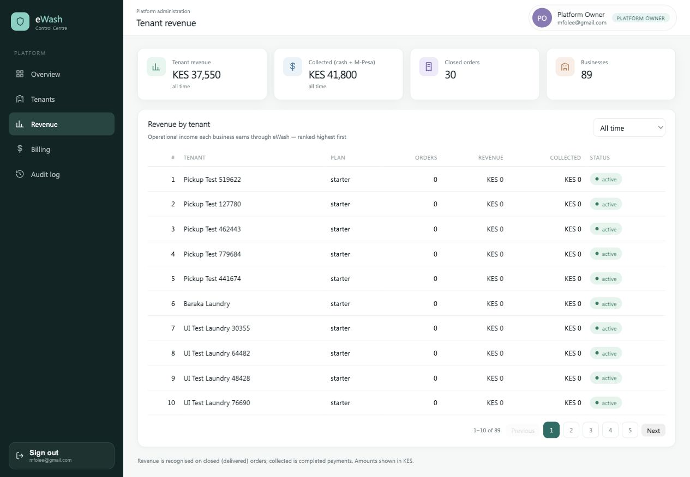

# eWash Laundry Management SaaS

eWash is a multi-tenant laundry management platform for operating laundry businesses, branches, users, orders, payments, finance, reporting, and platform-level tenancy billing from one Cloudflare-hosted application.

The application is built as one deployable service: a Cloudflare Worker serves the REST API under `/api/*` and the built Vue SPA from the same origin. There is no separate production frontend server.

## Contents

- [System architecture](SYSTEM.md)
- [Contributing guide](CONTRIBUTING.md)
- [Security policy](SECURITY.md)
- [Code of conduct](CODE_OF_CONDUCT.md)
- [License](LICENSE)

## Technology Stack

| Layer | Technology |
| --- | --- |
| Frontend | Vue 3, Vite, Pinia, Vue Router |
| Backend | Cloudflare Workers, Hono |
| Database | Cloudflare D1 SQLite, Drizzle ORM |
| Auth | JWT access tokens, rotating refresh tokens, PBKDF2 password hashes |
| Deployment | Wrangler, single Worker serving API and SPA assets |

## Main Capabilities

- Tenant onboarding with seeded laundry service catalog, default roles, default branches, and expense categories.
- Platform control centre for tenants, branches, subscriptions, invoices, platform revenue, and audit logs.
- Branch-aware tenant operations where tenant admins can manage all branches and branch users are limited to their assigned branch.
- Order intake, service pricing, rider/add-on services, kanban workflow, handoff recording, and historical order fulfilment.
- Cash and manual M-Pesa payment recording, credit customers, refunds, expenses, service providers, and recurring expenses.
- Finance reports, daily registers, dashboard KPIs, customer records, audit logs, and notification records.
- Password reset email flow using SMTP configuration.

## Screenshots

### Tenant Application

Tenant dashboard with daily KPIs, active orders, notifications, and branch context.



Orders board with workflow columns for received, washing, ironing, ready, and delivered orders.



New order assessment with seeded services, express handling, rider/add-on services, and price snapshot preparation.



### Platform Control Centre

Platform overview with tenant counts, active tenancy status, outstanding billing, and recent registrations.



Tenant management with search, lifecycle status, plan, branch, user, and outstanding billing columns.



Platform tenant revenue view with operating revenue, collections, closed orders, and ranked tenant performance.



## Local Setup

Install dependencies:

```bash
bun install
```

Start the full local app:

```bash
bun start
```

This builds the web app, applies local D1 migrations, and starts the Worker at:

```text
http://localhost:8787
```

Useful commands:

```bash
bun run build
bun run dev:api
bun run dev:web
bun run db:generate
bun run db:migrate:local
bun run db:migrate:remote
```

## Platform Admin Bootstrap

The platform console is available at:

```text
http://localhost:8787/platform/login
```

For local development, add bootstrap values to `api/.dev.vars`:

```dotenv
PLATFORM_ADMIN_EMAIL=owner@example.com
PLATFORM_ADMIN_PASSWORD=use-a-long-unique-password
PLATFORM_ADMIN_NAME=Platform Owner
```

For production, set these as Worker secrets:

```bash
cd api
bunx wrangler secret put PLATFORM_ADMIN_EMAIL
bunx wrangler secret put PLATFORM_ADMIN_PASSWORD
bunx wrangler secret put PLATFORM_ADMIN_NAME
```

The first matching platform sign-in creates the platform owner account. After that, sign-in uses the stored PBKDF2 password hash in D1.

## Deployment

Authenticate Wrangler once:

```bash
bunx wrangler login
```

Deploy:

```bash
bun run deploy
```

The deployment script builds the SPA, applies remote D1 migrations, deploys the Worker, and ensures required deployment configuration is present.

## Development Rules

Before contributing, read:

- `AGENTS.md` for repository rules followed by coding agents.
- `CLAUDE.md` and `instructions.md` for additional workflow and architectural context.
- `CONTRIBUTING.md` for human contributor workflow.

Important project rules:

- Reuse existing components and backend helpers before adding new abstractions.
- Keep all tenant data tenant-scoped and branch-aware where relevant.
- Use Drizzle schema changes with named migrations.
- Keep money in integer cents.
- Audit meaningful administrative, financial, pricing, and order-state changes.
- Run `bun run build` and relevant migration checks before submitting changes.

## License

This project is licensed under the MIT License. See [LICENSE](LICENSE).
